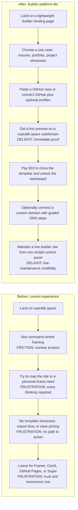

# User Journey: Supratik Space Builder Lite - Before vs After

Date: 2026-03-31

## Critical Friction Hotspot

The current homepage looks like an agent dashboard, so a busy builder never reaches a fast, confident "this is for me" moment.

## Current Journey

1. The visitor arrives expecting a personal-site or project-showcase product.
2. The homepage language signals "agent fleet" rather than "builder website."
3. The visitor cannot quickly see templates, pricing, or import options.
4. The visitor has no fast route to publish a site or showcase open source.
5. The visitor exits to a simpler website builder or GitHub Pages flow.

## Future Journey

1. The visitor lands on a clear landing page for busy builders.
2. The visitor selects a use case and sees one template framed in three modes.
3. The visitor imports a public GitHub repo or connects profile handles.
4. The visitor receives a live preview under `*.supratik.space`.
5. The visitor pays $10 to publish the site and access the dashboard.
6. The visitor optionally maps a custom domain without leaving the flow.
7. The visitor returns to the dashboard only when needed, not to babysit the site.
