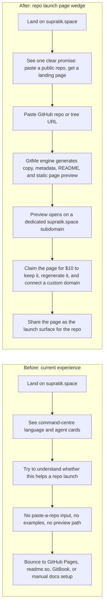

# User Journey: Repo To Launch Page - Before vs After

Date: 2026-03-31

Supersedes the earlier builder-lite framing by making the repo itself the product input.

## Critical Friction Hotspot

A builder lands on `supratik.space` today and cannot tell that a public GitHub repo can become a polished landing page in one step.

## Current Journey

1. A builder has an open-source repo but no sharp landing page for it.
2. They visit `supratik.space` and see an AI command-centre story instead of a repo-launch story.
3. They do not see a simple repo URL input or generated examples.
4. They leave to either hand-write docs, use GitHub Pages, or stitch together a docs tool and a marketing page.

## Future Journey

1. The builder arrives and immediately understands the product.
2. They paste a public GitHub repository or subdirectory URL.
3. The in-house GitMe pipeline analyzes the repo and produces launch-ready static artifacts.
4. A polished repo landing page appears on a deterministic `*.supratik.space` subdomain.
5. The builder either shares it immediately or pays `$10` to claim and enhance it.
6. The claimed owner connects a custom domain and regenerates the page as the repo evolves.
